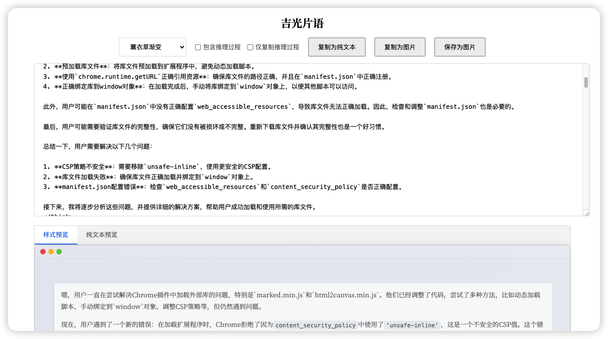

# 吉光片语 (Markdown Elegance)

[English](#english) | [中文](#中文)

## 中文

### 简介
吉光片语是一款简单而强大的 Markdown 格式转换工具，让你能够轻松地将 Markdown 内容转换为纯文本或精美图片。

### 截图展示

*工具栏中的插件图标*

*Markdown 内容转换界面*

### 主要功能
- 一键将 Markdown 格式转换为干净的纯文本
- 将 Markdown 内容转换为精美的图片
- 支持多种主题样式（晚霞、海洋、森林、薰衣草、蜜桃）
- 实时预览功能
- 简洁直观的操作界面

### 安装方法
1. 下载此仓库的 ZIP 文件
2. 解压下载的文件
3. 打开 Chrome 浏览器，访问 `chrome://extensions/`
4. 开启右上角的"开发者模式"
5. 点击"加载已解压的扩展程序"
6. 选择解压后的文件夹

### 使用方法
1. 点击浏览器工具栏中的插件图标
2. 粘贴你的 Markdown 内容
3. 选择转换方式：
   - 点击"复制为纯文本"将移除所有 Markdown 标记
   - 点击"复制为图片"将内容转换为精美图片
   - 点击"保存为图片"将图片保存到本地

### 注意事项
- 使用"复制为图片"功能时会打开新标签页
- 图片保存格式为 PNG
- 支持自定义主题样式

---

## English

### Introduction
Markdown Converter is a simple yet powerful tool that helps you convert Markdown content into plain text or beautiful images with ease.

### Features
- Convert Markdown to clean plain text with one click
- Transform Markdown content into beautiful images
- Multiple theme styles (Sunset, Ocean, Forest, Lavender, Peach)
- Real-time preview
- Clean and intuitive interface

### Installation
1. Download the ZIP file of this repository
2. Extract the downloaded file
3. Open Chrome browser and navigate to `chrome://extensions/`
4. Enable "Developer mode" in the top right corner
5. Click "Load unpacked"
6. Select the extracted folder

### How to Use
1. Click the extension icon in the browser toolbar
2. Paste your Markdown content
3. Choose conversion method:
   - Click "Copy as Text" to remove all Markdown formatting
   - Click "Copy as Image" to convert content to a beautiful image
   - Click "Save as Image" to save the image locally

### Notes
- "Copy as Image" function will open a new tab
- Images are saved in PNG format
- Customizable theme styles available